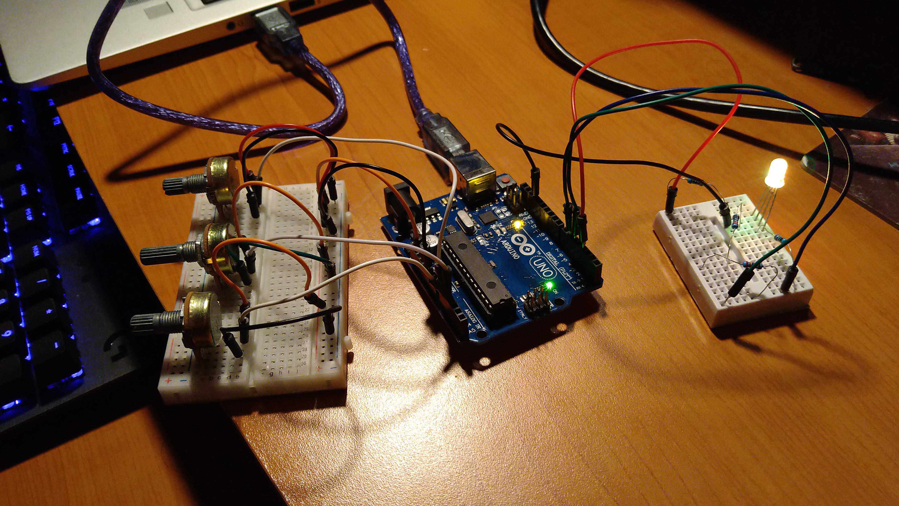
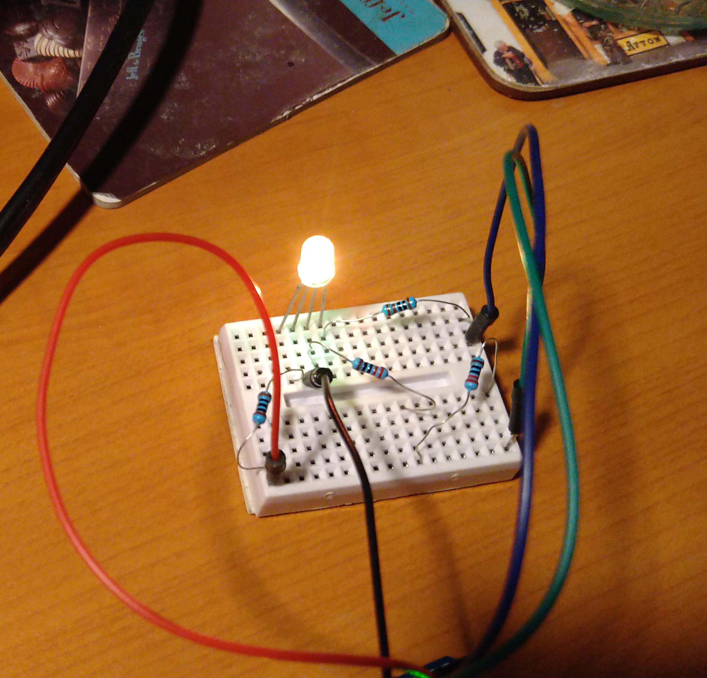
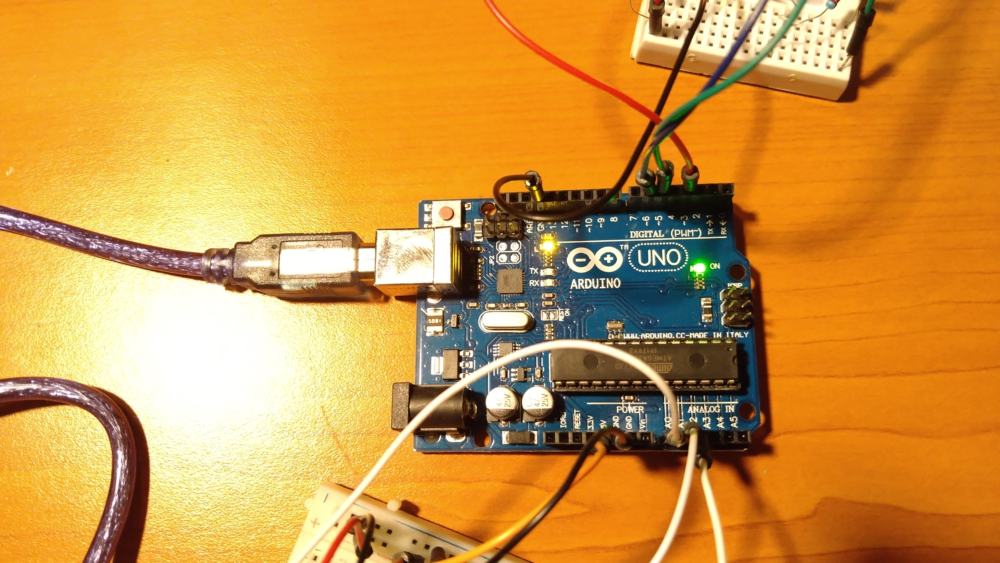
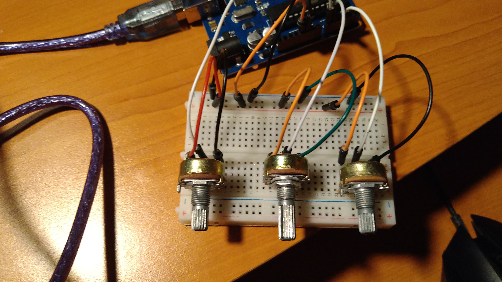
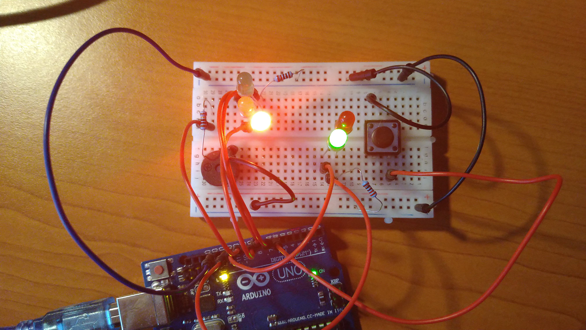

# IntroductionToRobotics
Introduction to Robotics (2021 - 2022)

Repo containing the homeworks of Victor, 3rd year srudent at the Faculty of Mathematics and Computer Science, University of Bucharest.
Each homework shall include requirements, implementation details, code and image files as necessary.

# Homework 1 RGB LED

Controlled by potentiometers

Use a separate potentiometer in controlling each of the colors of the RGB led (Red, Green and Blue).
The control must be done with digital electronics 
(aka you must read the value of the potentiome-ter with Arduino, and write a mapped value to each of the pins connected to the led).

Setup images

Showcase video

# Homework 2 Traffic light

Controlled by button

Use a button to start a cycle in which the traffic lights go trough the next process:
1. Keep green for vehicles and red for pedestrians with no sound for 10 seconds
2. Turn the traffic light for vehicles to yellow for 3 seconds
3. Turn the traffic light for vehicles to red and the traffic light for pedestrians to green and start beeping
4. Keep beeping for 10 seconds
5. Blink the green light for pedestrians and beep more frequently for 3 seconds
6. Turn the traffic light for pedestrians to red and the traffic light for vehicles to green, stop beeping and wait for next button press

Setup image

Showcase video

